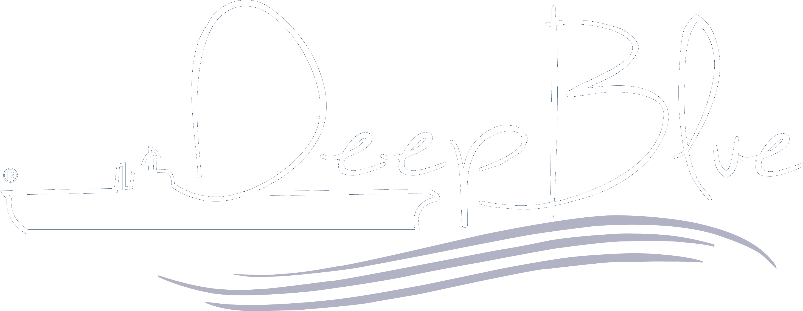

<p align="center">
  
</p>

# Line up Deep Blue

## Descripción
[Validación y reporte del Line up diario de Deep Blue]
Aplicación en Python que toma el lineup diario de distintos puertos:  valida y corrige tipos de datos, sigue las reglas de negocio de Deep Blue y finalmente formatea y crea el informe para la visualizacion de clientes en Excel

**Versión actual:** 0.5

---

## Guía de Inicio
El flujo de trabajo del proyecto es el siguiente:

1. **Carga de configuración:** Al iniciar, el programa lee automáticamente los valores del archivo `config.toml`.
2. **Edición en interfaz:** Puedes modificar campos como (puertos, nombres de agencia, umbrales de matching) directamente en el formulario. (en desarrollo varios campos [roadmap](docs/roadmap.md))
3. **Verificación de archivo auxiliar:** Asegurar que la ruta en `additional_data_path` apunte a donde tienes la tabla de datos auxiliares para la validacion.
4. **Ejecución:** Tras confirmar los parámetros en la UI, se dispara el proceso de carga,limpieza y validación (consultar la [guía de depuración](docs/depuration.md)).

---

## Configuración del Proyecto
Los campos editables en la aplicación están organizados bajo las siguientes categorias generales:

### Configuración General
Controla la identidad del reporte y las rutas físicas en el equipo:
* **Lógica de entrada/salida:** Determina la fila de encabezado en el Excel de origen y la ruta de destino del reporte generado.
* **Componentes visuales:** Define el directorio de assets que alimentará tanto la interfaz de Flet como el reporte final.

*No todas las categorias estan ya metidas en la interfaz, pero ya estan metidas en el json de configuración*

### Identificación de Compañía
Configuración específica para el resaltado de marca propia:
* **Criterios de Resaltado:** El nombre de la agencia definido en la configuración sirve como disparador. Si este nombre aparece en las columnas de charteador, armador o agencia, la aplicación aplicará visualmente el color corporativo (en formato hexadecimal) a dichas filas.

### Oficinas y Puertos
Define la estructura operativa por oficinas (falta en la interfaz):
* **Responsabilidad de puertos:** Permite asignar qué puertos pertenecen a cada oficina (ej. Barranquilla, Cartagena, Buenaventura).
* **Layouts de datos:** Define si el procesamiento de un puerto específico debe seguir la estructura estándar del line up (`default`) o una variante (`variant`). NOTA: La variante es el caso de coveñas, donde hay una columna de windiows y se cambian nombres de columnas.

### Estrategias de Validación (Matching) (falta en la interfaz)
Este módulo ajusta la sensibilidad de los algoritmos de matcheo de texto usando **Rapidfuzz** (Aplica para la busqueda de nombres de archivos y hojas principalmente):

#### Validación de Compañías (falta en la interfaz)
* **Interruptores de validación:** Permite habilitar o deshabilitar de forma independiente la validación de charteadores (*charterers*), armadores (*owners*) y agencias.
* **Scores de precisión:** Define el nivel de coincidencia mínimo necesario para que el programa acepte un nombre como válido. Un `token_set_ratio` más alto implica una validación más estricta para este procesador.

#### Validación de Puertos y Buques (falta en la interfaz)
* **Interruptor de validacion:** Permite habilidar o deshabilitar de forma independiente la validacion
* **Scores de precisión:** Si el matching está habilitado, el programa intentará corregir automáticamente nombres mal escritos basándose en los umbrales definidos.

---

## Estructura de Salida
| Archivo | Tipo | Comportamiento |
| :--- | :--- | :--- |
| `LINEUP_VALIDATION.html` | Generador | No sobrescribible si existe previamente. |
| `assets/` | Recursos | Contiene logos y estilos para el reporte. |

### Guía de Instalación y Compilación

#### 1. Clonar el repositorio
Primero, descargar el codigo fuente:

```bash
git clone https://github.com/JuanCastilloWork/Lineup_depurador
cd NOMBRE_DEL_REPOSITORIO
```

#### 2. Configurar el entorno virtual
No es obligatorio usar un entorno virtual, pero es lo mejor:

**En Windows:**
```bash
py -m venv .venv
.\.venv\Scripts\activate
```

**En macOS/Linux:**
```bash
python3 -m venv .venv
source .venv/bin/activate
```

#### 3. Instalar dependencias
Para el desarrollo, usar requirements_dev.txt:

```bash
pip install pip --upgrade
pip install -r requirements_dev.txt
```

#### 4. Ejecutar en modo desarrollo
Para probar que todo funciona correctamente antes de compilar, se puede ejecutar el app:

```bash
flet run main.py
```

#### 5. Compilar a ejecutable (.exe)
Para empaquetar la aplicación en un único archivo ejecutable para Windows, hay un modulo en PowerShell para simplificar los pasos

Para importar el modulo, ejecuta proyect.ps1 y posteriormente puedes llamar la funcion Invoke-FletBuild

```powershell
.\proyect.ps1
Invoke-FletBuild
```
---

### Notas adicionales
* El proyecto se recomienda usar ultima version de python (3.14).
* Si hay errores, verificar tener instalado el compilador de C++ necesario (en Windows es *Build Tools para Visual Studio*).

---
